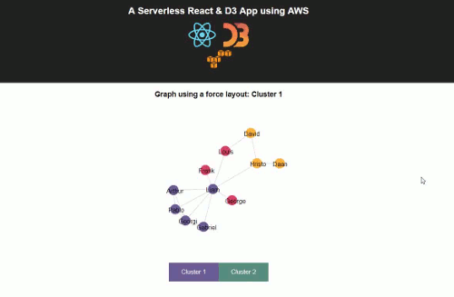

A Serverless React & D3 App using Firebase
==============================================

About
-----

<a href="https://d3js.org/">D3 (Data Driven Documents)</a> is a very useful javascript library when building visualizations. Links data to a DOM, where data-based transformations can be applied to the document.

While <a href="https://reactjs.org/">React</a>, on the other hand, builds the application through a large stack of calls to various rendering methods.

The combination of both by means of Node for the realization of a small serverless application is quite direct, thanks in great measure to the work done by the <a href="https://aws.amazon.com/s3/">create-react-app</a> package.

You can see it running here: <https://serverless-app-react-d3.firebaseapp.com/>
